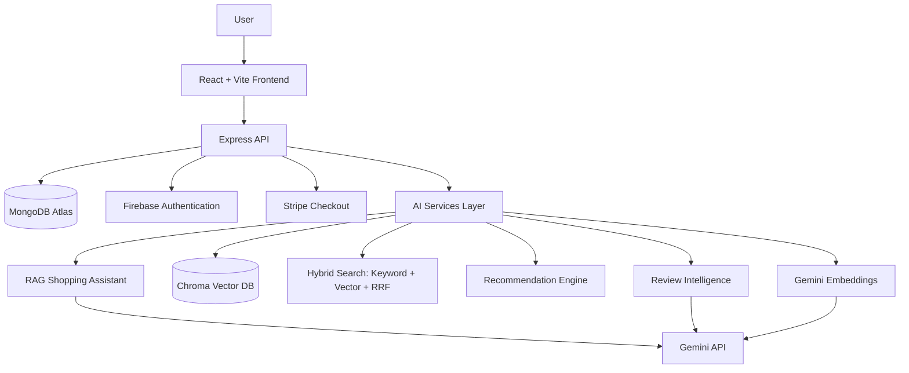

# NovaCart AI

An AI-powered e-commerce platform combining hybrid semantic search, personalized recommendations, a grounded RAG shopping assistant, and cached review intelligence — built as a hands-on AI engineering portfolio project.

**Live demo:** https://novacart-ai-peach.vercel.app
**Backend API:** https://novacart-backend-m5zy.onrender.com/api/health

> Note: the backend runs on Render's free tier, which sleeps after inactivity — the first request after a period of no traffic may take 30–60 seconds to respond.

---

## What this project actually does

NovaCart AI is a working online store, with an AI layer built on top of real e-commerce fundamentals rather than bolted onto a mockup:

- **Hybrid search** — combines keyword search with Gemini-embedding-based semantic search via Reciprocal Rank Fusion, so a query like "something to keep my drink cold" correctly surfaces a water bottle with zero shared vocabulary.
- **Recommendations** — three distinct types: embedding-similarity ("similar products"), order co-occurrence ("frequently bought together"), and a weighted personalized feed built from a real logged-in user's interaction history.
- **RAG shopping assistant** — a chat interface grounded strictly in the live product catalog via the same hybrid search pipeline, with tested guardrails against hallucination and off-topic questions.
- **Review intelligence** — batch-processed, cached sentiment/summary/pros/cons analysis per product using structured Gemini output.
- **Real payments** — Stripe Checkout (test mode) with webhook-driven order creation.

## Architecture



The AI layer (`ai-services/`) is deliberately kept separate from core e-commerce logic (`server/`) — either can evolve independently, and the RAG assistant reuses the exact same hybrid search pipeline as the storefront's search bar rather than duplicating retrieval logic.

## Features

- Product browsing, categories, hybrid search
- Cart, Stripe Checkout (test mode), webhook-driven order creation
- Firebase email/password authentication, synced to MongoDB
- Similar products, frequently bought together, personalized recommendations
- RAG shopping assistant with source citations and domain guardrails
- Cached review sentiment/summary/pros/cons
- Real interaction logging (views, cart adds) powering personalization

## Tech stack

| Layer | Technology |
|---|---|
| Frontend | React, Vite, Tailwind CSS |
| Backend | Node.js, Express |
| Database | MongoDB Atlas |
| Auth | Firebase Authentication |
| Payments | Stripe (test mode) |
| AI / LLM | Gemini API (`gemini-3.6-flash`), Gemini Embeddings (`gemini-embedding-001`) |
| Vector DB | Chroma |
| Deployment | Vercel (frontend), Render (backend + Chroma) |

## Folder structure
novacart-ai/
├── client/ # React frontend
├── server/ # Express backend (routes, controllers, models)
├── ai-services/ # Embeddings, retrieval, RAG, recommendations, reviews
├── scripts/ # Seed data, embedding generation, evaluation scripts
├── EVAL.md # Measured evaluation results
└── README.md


## How the AI systems work

### Search pipeline
User query → embedded via Gemini → compared against product vectors in Chroma (semantic) → simultaneously matched via MongoDB `$text` index (keyword) → both ranked lists merged via Reciprocal Rank Fusion → results below a relevance threshold filtered out → returned to frontend.

### Recommendation pipeline
- **Similar products**: a product's own embedding queried directly against Chroma.
- **Frequently bought together**: co-occurrence counted across real order history.
- **Personalized**: a user's last 50 interactions (view/cart/purchase, weighted by strength of signal) averaged into a single preference vector, then queried against Chroma.

### RAG pipeline
User question → same hybrid search pipeline retrieves relevant products → results formatted into a grounding context → Gemini answers using only that context, under an explicit system instruction restricting it to cited, real products and preventing fabricated prices/orders.

### Review intelligence
Reviews batch-processed once via Gemini with structured JSON output (sentiment, summary, pros, cons) → cached in MongoDB → served instantly on future page loads, never re-calling the API per view.

## Evaluation

See [EVAL.md](./EVAL.md) for full methodology and results, including:
- Search quality: Precision@5 and Mean Reciprocal Rank, keyword-only vs. hybrid
- RAG guardrail test suite (6/6 automated tests passing)
- Honest discussion of each evaluation's limitations

## Setup instructions (local development)

### Prerequisites
- Node.js
- A MongoDB Atlas account (free M0 tier)
- Firebase project with Email/Password auth enabled
- Gemini API key
- Stripe account (test mode)
- Python (for running Chroma locally)

### Environment variables

**`server/.env`**
PORT=5000
MONGODB_URI=your_mongodb_connection_string
GEMINI_API_KEY=your_gemini_key
STRIPE_SECRET_KEY=your_stripe_secret_key
STRIPE_WEBHOOK_SECRET=your_stripe_webhook_secret
CHROMA_HOST=localhost
CHROMA_PORT=8000
CHROMA_SSL=false
CLIENT_URL=http://localhost:5173


**`client/.env`**
VITE_API_URL=http://localhost:5000/api
VITE_FIREBASE_API_KEY=...
VITE_FIREBASE_AUTH_DOMAIN=...
VITE_FIREBASE_PROJECT_ID=...
VITE_FIREBASE_STORAGE_BUCKET=...
VITE_FIREBASE_MESSAGING_SENDER_ID=...
VITE_FIREBASE_APP_ID=...
VITE_STRIPE_PUBLISHABLE_KEY=...


### Running locally

```bash
# Terminal 1 — Chroma
chroma run --path ./chroma_data

# Terminal 2 — Backend
cd server && npm install && node server.js

# Terminal 3 — Frontend
cd client && npm install && npm run dev

# Terminal 4 — Stripe webhook forwarding (for local payment testing)
stripe listen --forward-to localhost:5000/api/checkout/webhook
```

### Seeding data

```bash
node --env-file=server/.env scripts/seed/seedProducts.js
node --env-file=server/.env scripts/embeddings/generateProductEmbeddings.js
node --env-file=server/.env scripts/embeddings/loadProductsToChroma.js
node --env-file=server/.env scripts/seed/seedOrders.js
node --env-file=server/.env scripts/seed/seedReviews.js
node --env-file=server/.env scripts/reviews/analyzeAllReviews.js
```

### Running evaluations

```bash
node --env-file=server/.env scripts/evaluation/evaluateSearch.js
node --env-file=server/.env scripts/evaluation/testRagGuardrails.js
```

## Deployment

Deployed entirely on free tiers: Vercel (frontend), Render (backend + self-hosted Chroma), MongoDB Atlas (M0). Chroma is self-hosted on Render rather than using Chroma Cloud specifically to avoid any billing risk, since Chroma Cloud's free tier requires a card on file. The tradeoff is Render's free-tier cold start (~30-60s) after inactivity, and no guaranteed persistent disk for Chroma on the free tier — meaning vector data may need reloading after a service restart.

## Limitations

- Small catalog (20 products) — evaluation results reflect this scale and would likely show a larger measurable gap between keyword and hybrid search at scale.
- Chroma's free-tier hosting doesn't guarantee persistent storage across restarts.
- Guardrail tests use pattern-matching, not a semantic LLM-judge — see EVAL.md for a specific example of this limitation and how it was caught.
- No formal RAG groundedness/hallucination scoring across a large question set yet.

## Future improvements

- LLM-as-judge evaluation for RAG guardrails and groundedness
- Larger evaluation dataset for search and recommendations (Hit Rate@K)
- Persistent Chroma storage (upgrade or alternative hosting)
- Docker Compose for one-command local setup